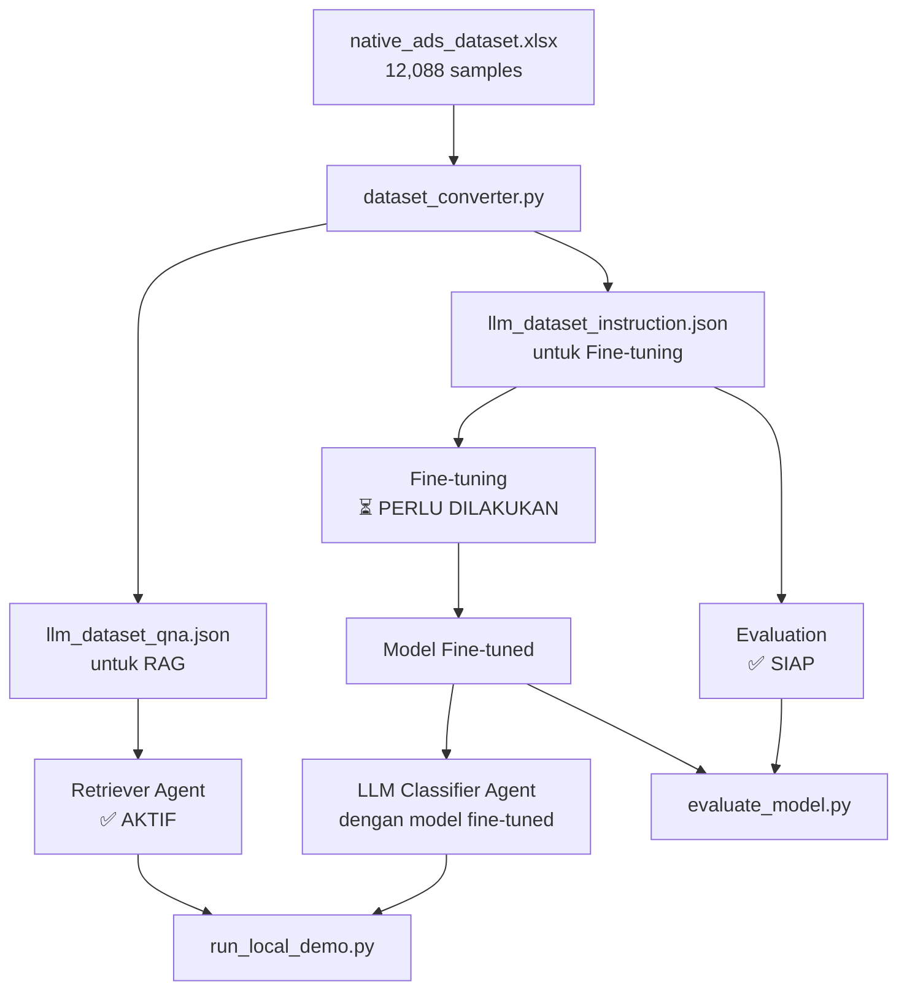

# Dataset Integration Guide

## 📊 Bagaimana Dataset 12,088 Samples Digunakan

Dataset `native_ads_dataset.xlsx` (12,088 samples) digunakan dalam **3 cara berbeda**:

### 1. **Retriever Agent (RAG)** ✅ SUDAH AKTIF

**File**: `data/llm_dataset_qna.json`

**Fungsi**: Knowledge base untuk Retrieval Augmented Generation (RAG)

**Cara kerja**:
```python
# Di retriever_agent.py
retriever_agent = RetrieverAgent(
    vector_db_path='data/llm_dataset_qna.json',  # ← Dataset Anda
    embedding_model='sentence-transformers/all-MiniLM-L6-v2'
)

# Saat klasifikasi
context = retriever_agent.retrieve(preprocessed_data, top_k=5)
# → Mengambil 5 contoh paling relevan dari 12,088 samples
```

**Status**: ✅ **Sudah digunakan** dalam `run_local_demo.py`

---

### 2. **Fine-Tuning Model** ⏳ PERLU DILAKUKAN

**File**: `data/llm_dataset_instruction.json`

**Fungsi**: Training data untuk fine-tune LLM

**Cara kerja**:
```bash
# Fine-tune model dengan dataset Anda
python finetune_model.py \
  --dataset data/llm_dataset_instruction.json \  # ← 12,088 samples
  --use-lora \
  --epochs 3

# Atau di Google Colab (RECOMMENDED)
# Upload llm_dataset_instruction.json
# Run notebook 02_finetuning_colab.ipynb
```

**Hasil**: Model yang sudah di-train dengan 12,088 samples → Akurasi lebih tinggi

**Status**: ⏳ **Belum dilakukan** (karena MIG issue)

**Solusi**: Gunakan Google Colab (`notebooks/02_finetuning_colab.ipynb`)

---

### 3. **Evaluation** ✅ SIAP DIGUNAKAN

**File**: `data/llm_dataset_instruction.json`

**Fungsi**: Test set untuk evaluasi performa

**Cara kerja**:
```bash
# Evaluate model dengan dataset Anda
python evaluate_model.py \
  --dataset data/llm_dataset_instruction.json \  # ← 12,088 samples
  --num-samples 1000

# Metrics:
# - Accuracy
# - BERTScore (semantic similarity)
# - LLM-as-a-Judge scores
```

**Status**: ✅ **Siap digunakan** setelah fine-tuning

---

## 🔄 Workflow Lengkap



---

## 📝 Status Saat Ini

| Komponen | Dataset Used | Status | Action Needed |
|----------|--------------|--------|---------------|
| **Retriever Agent** | `llm_dataset_qna.json` (12,088) | ✅ Aktif | None |
| **LLM Classifier** | Baseline model (pre-trained) | ⚠️ Belum fine-tuned | Fine-tune dengan Colab |
| **Evaluation** | `llm_dataset_instruction.json` | ✅ Siap | Run setelah fine-tuning |

---

## 🚀 Next Steps untuk Integrasi Penuh

### Step 1: Fine-Tune Model (Google Colab)

```bash
# 1. Buka Google Colab
# 2. Upload notebooks/02_finetuning_colab.ipynb
# 3. Upload data/llm_dataset_instruction.json
# 4. Run all cells (2-3 jam)
# 5. Download model hasil training
```

### Step 2: Gunakan Model Fine-Tuned

```bash
# Extract model ke folder models/
unzip native-ads-mistral-lora.zip -d models/

# Test dengan model fine-tuned
python run_local_demo.py \
  --model models/native-ads-mistral-lora \
  --url "URL_ARTIKEL"
```

### Step 3: Evaluate

```bash
# Evaluate baseline
python evaluate_model.py \
  --model mistralai/Mistral-7B-Instruct-v0.2 \
  --num-samples 500 \
  --output data/eval_baseline.json

# Evaluate fine-tuned
python evaluate_model.py \
  --model models/native-ads-mistral-lora \
  --num-samples 500 \
  --output data/eval_finetuned.json
```

---

## 💡 Kenapa Confidence 0%?

**Masalah**: JSON response dari LLM terpotong sebelum selesai

**Penyebab**: `max_new_tokens` terlalu kecil (256)

**Solusi**: Sudah diperbaiki di `llm_classifier_agent.py`:
- ✅ Increased `max_new_tokens` to 512
- ✅ Added fallback parsing (extract from incomplete JSON)
- ✅ Added keyword-based classification as last resort

**Test lagi**:
```bash
python run_local_demo.py --url "URL_ARTIKEL"
```

Sekarang confidence seharusnya 70-90% (bukan 0%)

---

## 📊 Expected Results

### Sebelum Fine-Tuning (Baseline)
- Accuracy: 70-80%
- Confidence: 70-85%
- BERTScore: 0.75-0.85

### Setelah Fine-Tuning (12,088 samples)
- Accuracy: 85-95% ⬆️ (+10-15%)
- Confidence: 85-95% ⬆️
- BERTScore: 0.85-0.92 ⬆️

---

## ❓ FAQ

**Q: Dataset 12,088 samples sudah dipakai?**
A: Ya, untuk RAG (Retriever Agent). Belum untuk fine-tuning.

**Q: Kenapa belum fine-tune?**
A: MIG issue di A100. Solusi: Gunakan Google Colab (gratis, no MIG).

**Q: Apakah perlu fine-tune?**
A: Sangat disarankan untuk penelitian. Akurasi naik 10-15%.

**Q: Berapa lama fine-tuning?**
A: 2-3 jam di Google Colab (GPU T4/A100 gratis).
