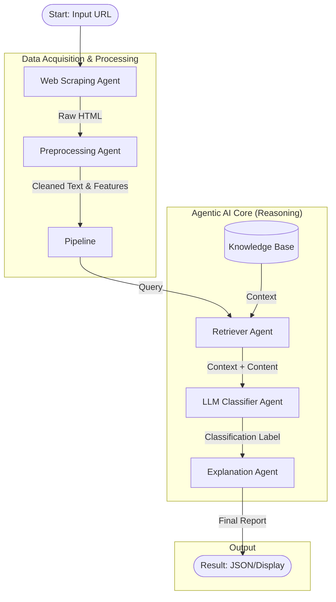

# Agentic AI untuk Deteksi Native Ads pada Portal Berita Elektronik

**Penelitian Postdoc**: Pengembangan sistem Agentic AI untuk mendeteksi native advertising pada portal berita elektronik menggunakan pendekatan multi-agent dengan LLM (Large Language Model) `openai/gpt-oss-20b`.

## 🗺️ Peta Metodologi (Architecture)

Sistem ini mengikuti alur kerja agentic sebagai berikut:



### Penjelasan Alur Agent:
1.  **Web Scraping Agent**: Mengambil data mentah dari URL berita.
2.  **Preprocessing Agent**: Membersihkan teks, menghapus noise, dan mengekstrak fitur linguistik.
3.  **Retriever Agent (RAG)**: Mencari contoh kasus serupa dari dataset `native_ads_dataset` untuk memberikan konteks pada LLM.
4.  **LLM Classifier Agent**: Menggunakan model `openai/gpt-oss-20b` untuk menentukan apakah artikel adalah Native Ads atau Editorial.
5.  **Explanation Agent**: Menjelaskan alasan keputusan klasifikasi dalam bahasa yang mudah dipahami.

---

## 🚀 Panduan Eksekusi (Step-by-Step)

Ikuti langkah-langkah ini secara **berurutan** untuk menjalankan sistem.

### 1. Persiapan Lingkungan (Environment)

Pastikan Anda memiliki Python 3.10+ dan GPU NVIDIA (disarankan VRAM >24GB untuk model 20B, atau gunakan teknik kuantisasi).

```bash
# 1. Buat Virtual Environment
python -m venv .venv
.venv\Scripts\activate  # Windows
# source .venv/bin/activate  # Mac/Linux

# 2. Install Dependencies utama
pip install -r requirements.txt

# 3. Install PyTorch dengan dukungan CUDA (Wajib untuk GPU)
pip install torch torchvision torchaudio --index-url https://download.pytorch.org/whl/cu124
pip install accelerate
```

### 2. Persiapan Data (Dataset Converter)

Sebelum menjalankan AI, kita perlu "melatih" ingatan Retriever Agent dengan mengubah dataset Excel menjadi knowledge base.

*   **Input**: `native_ads_dataset.xlsx` (Excel file)
*   **Output**: `data/llm_dataset_qna.json`

**Jalankan Command:**
```bash
python tools/dataset_converter.py
```
*Ikuti instruksi di layar (Pilih format `1` untuk RAG).*

### 3. Menjalankan Demo (Execution)

Gunakan script `run_local_demo.py` untuk menjalankan seluruh pipeline agent pada satu artikel berita.

**Command:**
```bash
python run_local_demo.py --url "MASUKKAN_URL_BERITA_DISINI"
```

**Contoh:**
```bash
python run_local_demo.py --url "https://www.cnnindonesia.com/ekonomi/20231212140523-532-1036329/promo-spesial-bri-di-hut-ke-128-diskon-hingga-rp1-28-juta"
```

*Catatan: Saat pertama kali dijalankan, sistem akan otomatis mendownload model `openai/gpt-oss-20b` dari HuggingFace. Proses ini membutuhkan koneksi internet dan waktu beberapa saat.*

---

## 📂 Struktur Project

*   `run_local_demo.py`: Script utama untuk menjalankan demo.
*   `config.json`: File konfigurasi (nama model, parameter).
*   `agents/`: Folder berisi kode untuk setiap agent.
    *   `web_agent.py`: Scraping.
    *   `preprocessing_agent.py`: Cleaning.
    *   `retriever_agent.py`: Retrieval/Search.
    *   `llm_classifier_agent.py`: Klasifikasi (Core AI).
    *   `explanation_agent.py`: Penjelasan hasil.
*   `tools/`: Tools bantu (konverter data, augmentasi).
*   `data/`: Tempat menyimpan dataset dan hasil output.

---

## ⚠️ Troubleshooting

1.  **Out of Memory (OOM)**: Jika VRAM GPU tidak cukup untuk model 20B, Anda mungkin perlu mengubah model di `config.json` ke model yang lebih kecil (misal: `gpt2` atau `bert-base-uncased`) untuk testing awal, atau menggunakan versi terkuantisasi (bitsandbytes).
2.  **HuggingFace Login**: Jika model `gpt-oss-20b` bersifat gated/private, login dulu via terminal:
    ```bash
    huggingface-cli login
    ```
